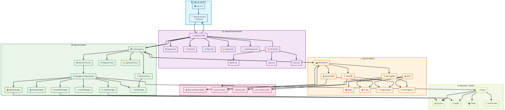
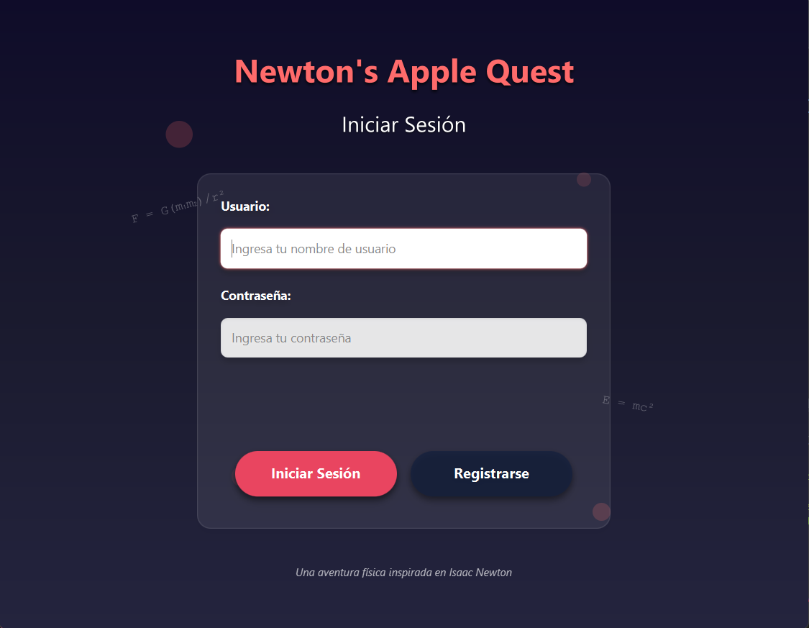
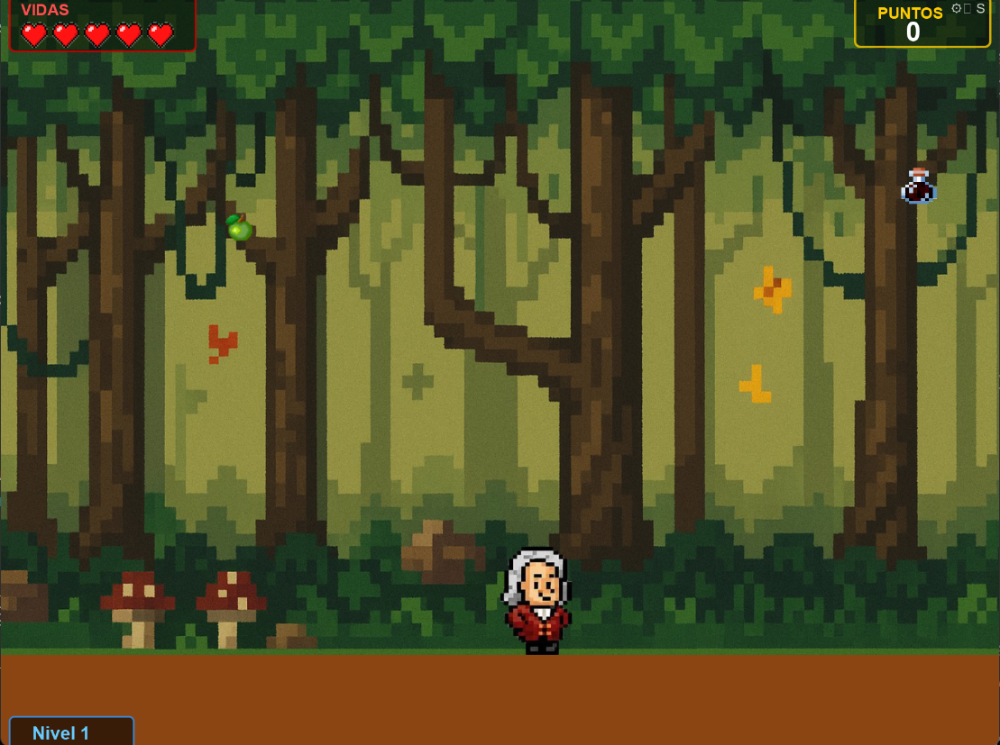
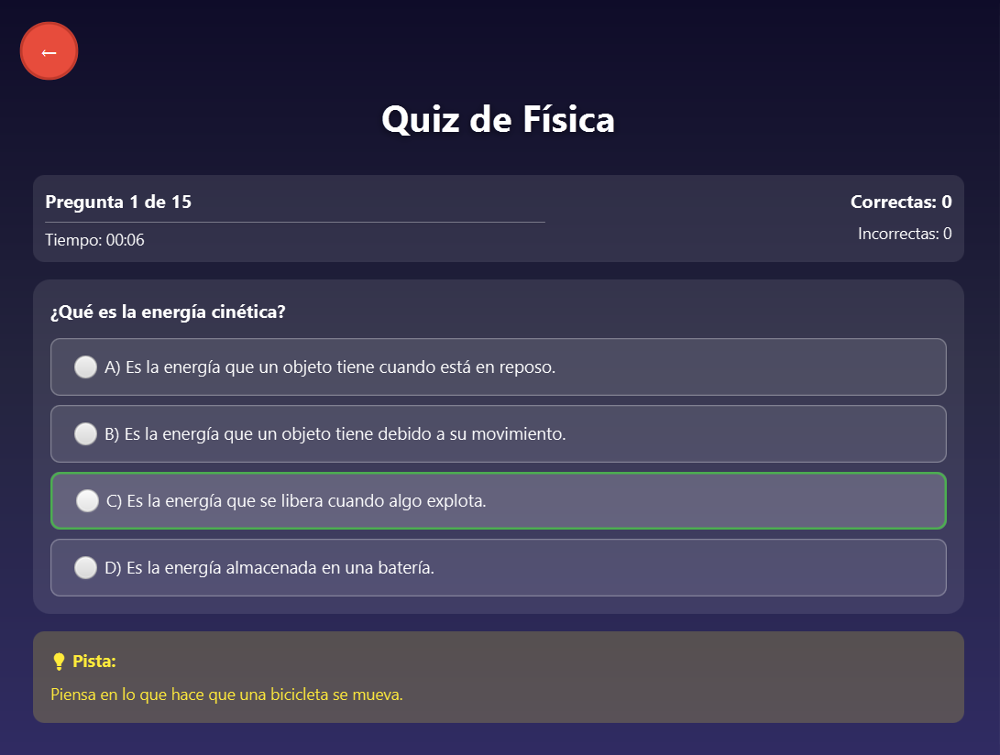
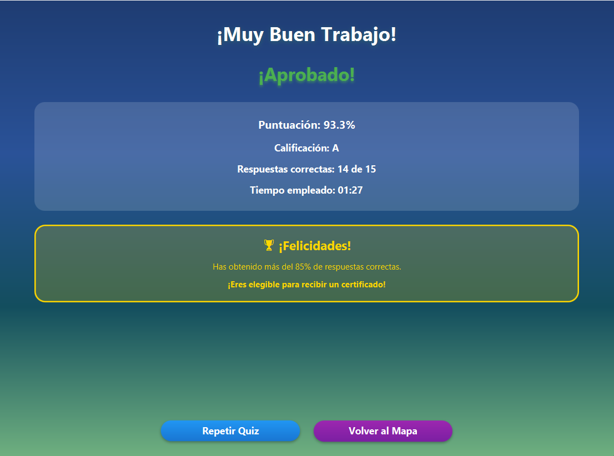

# 🍎 Newton's Apple Quest

[](https://www.java.com/)
[](https://openjfx.io/)
[](https://www.mysql.com/)
[](https://netbeans.apache.org/)

> **Un emocionante juego educativo que combina diversión y aprendizaje de física a través de la historia de Isaac Newton y sus famosas leyes.**

---

## 📖 Descripción del Proyecto

**Newton's Apple Quest** es un juego educativo interactivo desarrollado en Java con JavaFX que enseña conceptos fundamentales de física de manera divertida y engaging. Los jugadores controlan a Newton recolectando manzanas que caen del árbol mientras aprenden sobre fórmulas físicas esenciales como la gravedad, velocidad, energía y aceleración.

### 🎯 Características Principales

- **🎮 Juego Principal**: Recolecta manzanas rojas (+10 puntos) y evita las verdes (-5 puntos)
- **📚 Sistema Educativo**: Desbloquea 5 fórmulas físicas de Newton basadas en tu puntuación
- **🧠 Quiz Interactivo**: 15 preguntas de física con sistema de pistas y explicaciones
- **🎬 Videos Educativos**: Contenido multimedia sobre la biografía de Newton y conceptos físicos
- **🏆 Sistema de Ranking**: Compite con otros jugadores y guarda tus mejores puntuaciones
- **📜 Certificados**: Genera certificados PDF al completar exitosamente el quiz
- **🎵 Audio Inmersivo**: Música de fondo y efectos de sonido para una experiencia completa

---

## 🔬 Conceptos Físicos Incluidos

El juego enseña las siguientes fórmulas fundamentales de la física:

| Fórmula             | Descripción        | Aplicación en el Juego             |
| ------------------- | ------------------ | ---------------------------------- |
| `F = m × g`         | Fuerza de gravedad | Velocidad de caída de las manzanas |
| `v = d / t`         | Velocidad media    | Cálculo de movimiento del jugador  |
| `U = m × g × h`     | Energía potencial  | Energía de las manzanas en altura  |
| `K = ½ × m × v²`    | Energía cinética   | Energía de objetos en movimiento   |
| `a = (vf - vi) / t` | Aceleración        | Cambios de velocidad en el juego   |

---

## 🚀 Instalación y Configuración

### Prerrequisitos

- **Java JDK 8+** (con JavaFX incluido)
- **MySQL 8.0+** para la base de datos
- **NetBeans IDE** (recomendado) o cualquier IDE compatible con Java

### Pasos de Instalación

1. **Clonar el repositorio**

   ```bash
   git clone https://github.com/LIUNKS/AlgoritmosYEstructurasDeDatos.git
   cd AlgoritmosYEstructurasDeDatos/newtons-quest
   ```

2. **Configurar la base de datos**

   - Crear una base de datos MySQL llamada `newtons_quest`
   - Ejecutar los scripts SQL para crear las tablas necesarias
   - Configurar las credenciales en `ConexionDB.java`

3. **Instalar dependencias**

   - Las librerías necesarias están en la carpeta `lib/`:
     - `mysql-connector-j-8.4.0.jar`
     - `itextpdf-5.5.13.2.jar`

4. **Ejecutar el proyecto**
   ```bash
   # Desde NetBeans: Clic derecho en el proyecto > Run
   # O desde terminal:
   java -cp "lib/*:build/classes" Main._Main
   ```

---

## 🎮 Cómo Jugar

### 1. **Registro y Login**

- Crea una cuenta nueva o inicia sesión con credenciales existentes
- El sistema guarda tu progreso y estadísticas

### 2. **Juego Principal**

- Usa las **flechas del teclado** para mover a Newton
- **Recolecta manzanas rojas** para ganar puntos (+10)
- **Evita las manzanas verdes** que restan puntos (-5)
- Cada manzana roja perdida te cuesta una vida (-3 puntos)

### 3. **Progresión**

- Alcanza ciertos puntajes para desbloquear fórmulas físicas:
  - 🥉 **100 puntos**: Primera fórmula
  - 🥈 **250 puntos**: Segunda fórmula
  - 🥇 **500 puntos**: Tercera fórmula
  - 💎 **750 puntos**: Cuarta fórmula
  - 👑 **1000 puntos**: Quinta fórmula

### 4. **Quiz Final**

- Una vez desbloqueadas todas las fórmulas, accede al quiz
- Responde 15 preguntas sobre física
- Necesitas **85% de aciertos** para aprobar
- Genera tu certificado PDF al completar exitosamente

---

## 🏗️ Arquitectura del Proyecto

### 📐 Estructura General

El proyecto sigue una arquitectura **MVC (Model-View-Controller)** bien definida con separación clara de responsabilidades:

```
newtons-quest/
├── src/
│   ├── 🎮 Controlador/          # CAPA DE CONTROL
│   │   ├── 📁 componentes/      # Gestores especializados del juego
│   │   ├── 📁 constants/        # Constantes y configuraciones globales
│   │   ├── 📁 dialogs/          # Ventanas emergentes y diálogos
│   │   ├── 📁 navigation/       # Sistema de navegación entre vistas
│   │   ├── 📁 utils/            # Utilidades y herramientas auxiliares
│   │   ├── 📄 GameController.java
│   │   ├── 📄 LoginController.java
│   │   ├── 📄 MainController.java
│   │   ├── 📄 MapController.java
│   │   ├── 📄 QuizController.java
│   │   ├── 📄 QuizResultController.java
│   │   └── 📄 RegisterController.java
│   │
│   ├── 📊 Modelo/               # CAPA DE DATOS
│   │   ├── 📁 dao/              # Acceso a datos (Data Access Objects)
│   │   │   ├── 📄 QuizDAO.java
│   │   │   ├── 📄 RankingDAO.java
│   │   │   └── 📄 UsuarioDAO.java
│   │   ├── 📁 dto/              # Objetos de transferencia de datos
│   │   │   ├── 📄 Apple.java
│   │   │   ├── 📄 Player.java
│   │   │   ├── 📄 Potion.java
│   │   │   ├── 📄 QuizQuestion.java
│   │   │   ├── 📄 QuizResult.java
│   │   │   └── 📄 RankingEntry.java
│   │   └── 📄 ConexionDB.java   # Gestión de conexiones a BD
│   │
│   ├── 🖼️ Vista/                # CAPA DE PRESENTACIÓN
│   │   ├── 📁 resources/        # Recursos de estilo
│   │   ├── 📄 Game.fxml         # Interfaz del juego principal
│   │   ├── 📄 Login.fxml        # Pantalla de inicio de sesión
│   │   ├── 📄 Main.fxml         # Menú principal
│   │   ├── 📄 Map.fxml          # Mapa de progreso
│   │   ├── 📄 Quiz.fxml         # Interfaz del quiz
│   │   ├── 📄 QuizResult.fxml   # Resultados del quiz
│   │   └── 📄 Register.fxml     # Registro de usuarios
│   │
│   ├── 🎨 recursos/             # ASSETS Y RECURSOS
│   │   ├── 📁 certificado/      # Plantillas para certificados PDF
│   │   ├── 📁 imagenes/         # Imágenes del UI y fondos
│   │   ├── 📁 musica/           # Archivos de música de fondo
│   │   ├── 📁 sonidos/          # Efectos de sonido
│   │   ├── 📁 sprites/          # Sprites de personajes y objetos
│   │   └── 📁 videos/           # Videos educativos
│   │
│   └── 🚀 Main/                 # PUNTO DE ENTRADA
│       ├── 📄 _Main.class       # Clase compilada
│       └── 📄 _Main.java        # Clase principal de la aplicación
│
├── 📚 lib/                      # LIBRERÍAS EXTERNAS
│   ├── itextpdf-5.5.13.2.jar   # Generación de PDFs
│   └── mysql-connector-j-8.4.0.jar # Conector MySQL
│
└── 🔨 build/                    # ARCHIVOS COMPILADOS
    └── classes/                 # Bytecode Java compilado
```

### 🔧 Componentes Arquitectónicos Detallados

#### 🎮 **Capa Controlador** - Lógica de Negocio

| Componente            | Responsabilidad   | Descripción                                         |
| --------------------- | ----------------- | --------------------------------------------------- |
| **`GameController`**  | Motor del juego   | Gestiona el bucle principal, colisiones y mecánicas |
| **`QuizController`**  | Sistema educativo | Maneja preguntas, respuestas y progreso del quiz    |
| **`LoginController`** | Autenticación     | Validación de credenciales y gestión de sesiones    |
| **`MapController`**   | Navegación        | Control del mapa de progreso y desbloqueables       |

##### 📁 **Subcarpetas del Controlador:**

- **`componentes/`**: Managers especializados
  - `AppleManager` - Generación y física de manzanas
  - `AudioManager` - Sistema de audio y música
  - `PlayerManager` - Control del personaje Newton
  - `ScoreManager` - Puntuaciones y ranking
  - `RenderManager` - Renderizado gráfico
- **`constants/`**: Configuraciones estáticas
  - `GameConstants` - Constantes del juego
- **`dialogs/`**: Interfaces emergentes
  - `RankingDialog` - Tabla de puntuaciones
  - `RulesDialog` - Reglas del juego

#### 📊 **Capa Modelo** - Gestión de Datos

| Tipo         | Propósito              | Archivos                                |
| ------------ | ---------------------- | --------------------------------------- |
| **DAO**      | Acceso a base de datos | `QuizDAO`, `RankingDAO`, `UsuarioDAO`   |
| **DTO**      | Objetos de datos       | `Apple`, `Player`, `QuizQuestion`, etc. |
| **Conexión** | Gestión de BD          | `ConexionDB`                            |

#### 🖼️ **Capa Vista** - Interfaces de Usuario

**Archivos FXML** que definen las interfaces gráficas:

- `Game.fxml` - Canvas del juego principal
- `Quiz.fxml` - Interfaz de preguntas interactivas
- `Map.fxml` - Mapa de progreso visual
- `Login.fxml` / `Register.fxml` - Autenticación

### 🔧 **Stack Tecnológico**

| Categoría          | Tecnología     | Propósito                            |
| ------------------ | -------------- | ------------------------------------ |
| **Core**           | Java 8+        | Lenguaje principal de desarrollo     |
| **UI Framework**   | JavaFX         | Interfaces gráficas modernas         |
| **UI Definition**  | FXML           | Definición declarativa de interfaces |
| **Styling**        | CSS            | Estilos y temas visuales             |
| **Database**       | MySQL 8.0+     | Persistencia de datos                |
| **DB Connector**   | JDBC           | Conectividad con base de datos       |
| **PDF Generation** | iText 5.5.13.2 | Certificados en PDF                  |
| **Build System**   | Apache Ant     | Compilación y construcción           |
| **IDE**            | NetBeans       | Entorno de desarrollo integrado      |

### 🏛️ **Patrones de Diseño Implementados**

| Patrón        | Implementación                      | Beneficio                      |
| ------------- | ----------------------------------- | ------------------------------ |
| **MVC**       | Separación Controlador/Modelo/Vista | Mantenibilidad y escalabilidad |
| **Manager**   | `*Manager` classes                  | Responsabilidades específicas  |
| **DAO**       | Acceso a datos abstraído            | Independencia de la BD         |
| **Observer**  | Callbacks en managers               | Comunicación entre componentes |
| **Singleton** | Gestores únicos                     | Control de instancias          |
| **Factory**   | Creación de objetos del juego       | Flexibilidad en instanciación  |

### 🔄 **Flujo de Datos y Arquitectura del Sistema**



_Diagrama completo del flujo de datos y arquitectura del sistema Newton's Apple Quest_

#### 📋 **Descripción del Flujo**

1. **👤 Usuario** → Interactúa con el sistema a través del mouse y teclado
2. **🖼️ Vista FXML** → Captura eventos y presenta la interfaz gráfica
3. **🎮 Controlador** → Procesa la lógica de negocio y coordina componentes
4. **⚙️ Managers** → Gestores especializados manejan funcionalidades específicas
5. **📊 Modelo/DAO** → Abstrae el acceso a datos y operaciones de persistencia
6. **🗄️ Base de Datos** → Almacena información de usuarios, puntuaciones y resultados
7. **🎨 Recursos** → Proporciona assets multimedia para la experiencia del usuario

#### 🔗 **Interacciones Clave**

- **GameController** ↔ **AppleManager**: Gestión de manzanas y colisiones
- **QuizController** ↔ **QuizDAO**: Carga de preguntas y guardado de resultados
- **AudioManager** ↔ **Recursos**: Reproducción de música y efectos
- **ScoreManager** ↔ **RankingDAO**: Gestión de puntuaciones y rankings

### 🎯 **Ventajas de esta Arquitectura**

✅ **Modularidad**: Cada componente tiene responsabilidades bien definidas  
✅ **Escalabilidad**: Fácil agregar nuevas funcionalidades  
✅ **Mantenibilidad**: Cambios aislados por capas  
✅ **Testabilidad**: Componentes independientes  
✅ **Reutilización**: Managers reutilizables  
✅ **Separación de responsabilidades**: UI, lógica y datos separados

---

## 🎨 Capturas de Pantalla

### 🔐 Pantalla de Login


_Interfaz de inicio de sesión - Acceso seguro para usuarios registrados_

### 📝 Pantalla de Registro


_Formulario de registro de nuevos usuarios - Creación de cuenta rápida y sencilla_

### 🗺️ Mapa de Progreso


_Visualiza tu avance y accede a diferentes secciones del juego - Desbloquea contenido según tu progreso_

### 🎮 Gameplay


_Newton recolectando manzanas mientras aprende física - Mecánicas de juego intuitivas y educativas_

### 🧠 Quiz Interactivo


_Sistema de preguntas con pistas y explicaciones detalladas - Aprendizaje interactivo y progresivo_

### 🏆 Resultados y Certificación


_Pantalla de resultados con certificado PDF generado automáticamente_

## 👨‍💻 Desarrollo y Contribución

### Estructura de Clases Principales

- **`GameController`**: Controlador principal del juego
- **`AppleManager`**: Gestión de la generación y física de manzanas
- **`PlayerManager`**: Control del personaje de Newton
- **`QuizController`**: Sistema de quiz educativo
- **`ScoreManager`**: Gestión de puntuaciones y ranking
- **`AudioManager`**: Sistema de audio y efectos

### Patrones de Diseño Implementados

- **MVC (Model-View-Controller)**: Separación clara de responsabilidades
- **Manager Pattern**: Para componentes del juego
- **Observer Pattern**: Para eventos y callbacks
- **Factory Pattern**: Para creación de objetos del juego

---

## 📊 Sistema de Puntuación

| Acción                   | Puntos |
| ------------------------ | ------ |
| Manzana roja recolectada | +10    |
| Manzana verde tocada     | -5     |
| Manzana roja perdida     | -3     |

---

## 🎓 Valor Educativo

Este proyecto demuestra:

- **Programación Orientada a Objetos** con Java
- **Desarrollo de interfaces gráficas** con JavaFX
- **Gestión de bases de datos** con MySQL
- **Patrones de diseño** y arquitectura de software
- **Desarrollo de juegos** y física básica
- **Integración multimedia** (audio, video, gráficos)

---

## 📄 Licencia

Este proyecto está licenciado bajo la **Licencia MIT** - consulta el archivo [LICENSE](LICENSE) para más detalles.

### ¿Qué significa esto?

✅ **Uso libre**: Puedes usar el código para proyectos personales y comerciales  
✅ **Modificación**: Puedes modificar el código según tus necesidades  
✅ **Distribución**: Puedes compartir y distribuir el código  
✅ **Sublicencia**: Puedes sublicenciar el código bajo otros términos  
✅ **Venta**: Puedes vender software que incluya este código

**Única condición**: Incluir el aviso de copyright y la licencia en las copias.

_Desarrollado como parte del curso de **Algoritmos y Estructuras de Datos** con fines educativos._

---

## 👨‍🔬 Autor

**Johann** - Desarrollador Principal

- Diseño y arquitectura del sistema
- Implementación de mecánicas de juego
- Desarrollo del sistema educativo
- Integración de contenido multimedia

---

## 🙏 Agradecimientos

- **Isaac Newton** por inspirar este proyecto educativo
- **OpenJFX** por la excelente plataforma de desarrollo
- **MySQL** por el sistema de base de datos robusto
- **iText** por las capacidades de generación de PDF

---

<div align="center">

**¿Te gustó el proyecto? ¡Dale una ⭐ y compártelo!**

_"Si he visto más lejos es porque estoy sentado sobre los hombros de gigantes."_ - Isaac Newton

</div>
